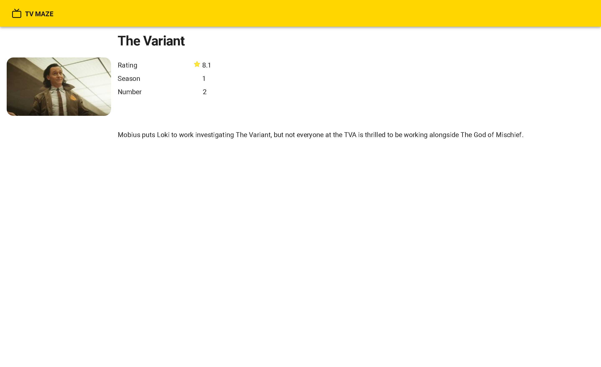
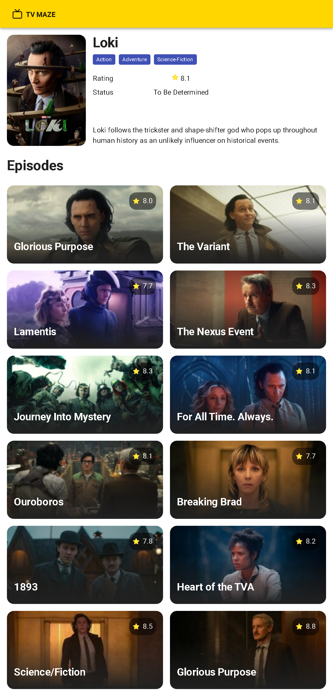
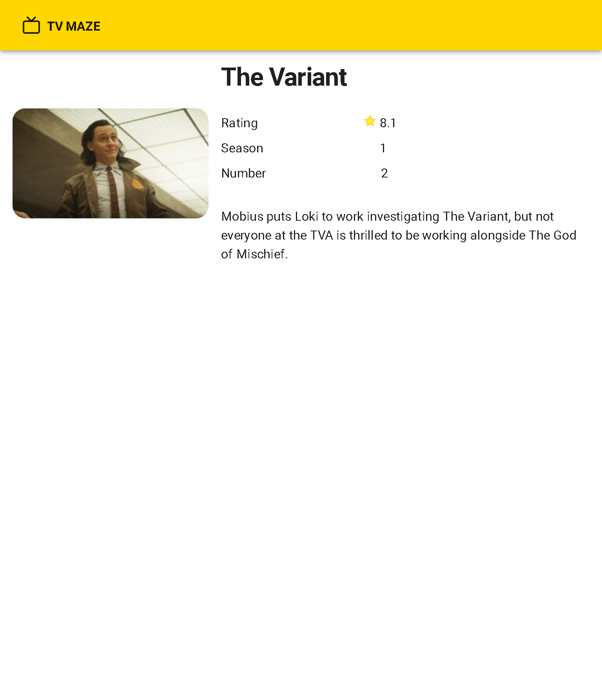
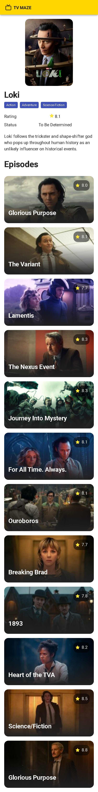
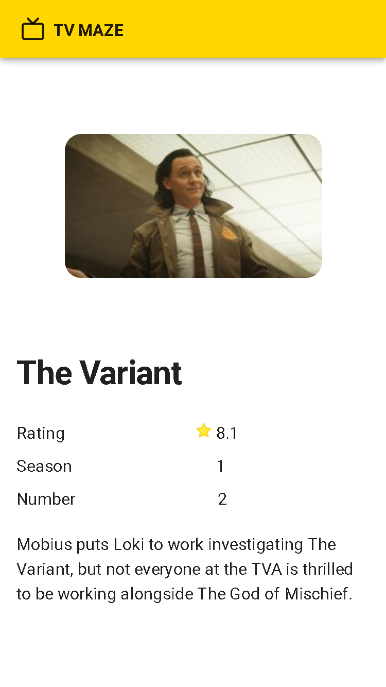

<h1 align="center">Tv Maze</h1>
<div align="center">


</div>

This project is a simple application made in React using the [Tv Maze API](http://api.tvmaze.com), its goal is to apply the best practices for the development of an application in React.

This application searches for series and shows some information about them, as well as episode information.

This application is also available on [github pages](https://carloshrabelo.dev/tvmaze/)

## Preview
| Home                   | Show                           | Episode                           |
| ------------------------- | -------------------------------- | -------------------------------- |
|  |  |  |
|  |  |  |
|  |  |  |

## Installation

You need the [node](https://nodejs.org/en/download/) to run this project, this example was created for the version `v20.9.0`. Dependencies was installed with [yarn](https://classic.yarnpkg.com/en/)

### Install yarn
```bash
npm -g yarn
```

### Install dependencies
```bash
yarn install
```

## Run application

Before running the application you will need to create a `.env.development` file in the project root, you can rename `.env.development.sample` without needing to make any changes

### Dev

```bash
yarn start
```

### Prod

Before deploying the application you will need to create a `.env.production` file in the project root, you can rename `.env.production.sample` without needing to make any changes

```bash
yarn build

npm install -g serve
serve -s build
```

Open [http://localhost:3000](http://localhost:3000) with your browser to see the result.

## Folder structure

```
📂 docs - Files referring to documentation
📂 public - Static file serving
📂 src/
┣━╾📂 components - UI components
┣━╾📂 hook  - React Hooks
┣━╾📂 lib - Libraries configuration
┣━╾📂 mock - Mocks files to be used in test files
┣━╾📂 page - Pages that will be displayed
┣━╾📂 store - Storage configuration
┣━╾📂 types - Types
┗━╾📂 utils - Functions helpers
```

## Licença

The [MIT License]() (MIT)

Copyright :copyright: 2024
